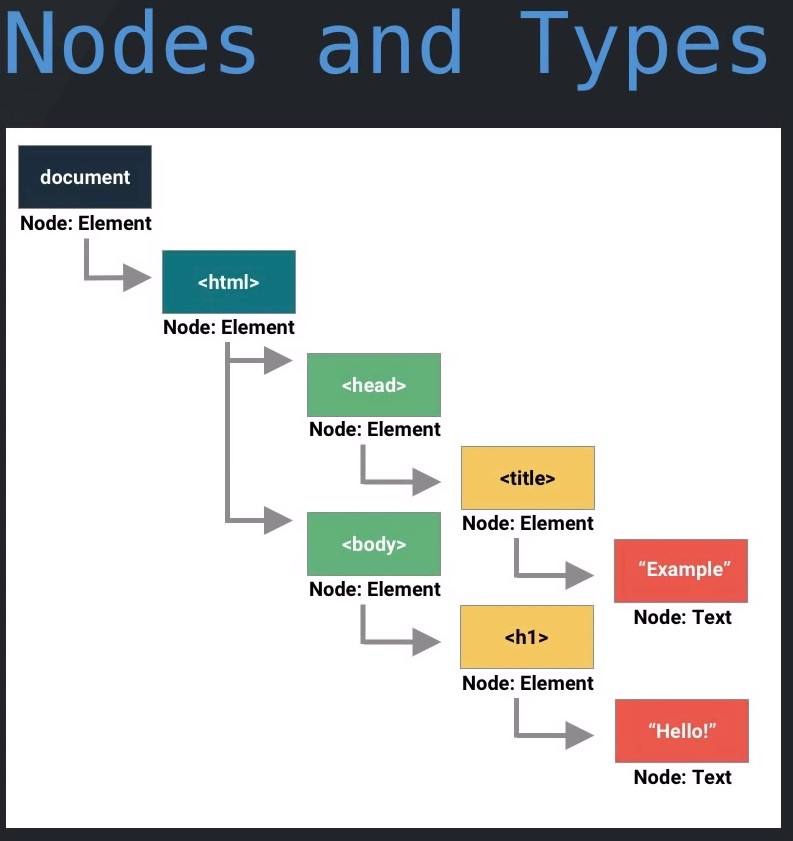

# Document Object Model (DOM)

* just an object representation of the html elements of  a webpage
* Language neutral API
* Tree like structure representing your content, structure, and style

* Dynamic
* Bridge between content and browser

* **THE DOM IS NOT**
    * JavaScript
    * HTML
    * CSS
    * Static

# DOM Selectors
* `document` has several built-in methods for accessing the exact element(s) we want.
* all of these methods are case sensitive
*  **HTMLCollection**, is an array-like object containing all the elements that contain the element name supplied, have numerical zero-based indices and the length property
*  **NodeList**, is an array-like object containing all the elements that contain the element name supplied,  have numerical zero-based indices, the length property and access to the forEach array method
* The Array class contains a method we can use to create an array from an array-like object, called .from(). To use this, we would give .from the array-like object as its only argument.
`Array.from(arrayLikeObject)`

* `getElement` Methods
    * each takes a single string as the only argument, containing either the id or class you are looking for
    
        Method | Returns | #2 | #3 | #4 |
        --- | --- | --- | --- |--- |--- |
        getElementsByTagName(‘p’) |  HTMLCollection  | 283 | 290 | 286 |
        getElementsByClassName(‘className’) | HTMLCollection | 283 | 290 | 286 |
        getElementById(‘idName’) | matching element | 283 | 290 | 286 |
        getElementsByTagName(‘p’) | 301 | 283 | 290 | 286 |

* `querySelector` Methods
    * These methods allow us to select element(s) based on CSS style selectors (remember . is class and # is id). Each method takes a string containing the selectors and returns the element(s). 
       Method | Returns | #2 | #3 | #4 |
        --- | --- | --- | --- |--- |--- |
        querySelector(‘.custom-style’) |   first element that matches the value  | 283 | 290 | 286 |
        .querySelectorAll(‘a’) | NodeList | 283 | 290 | 286 |
        querySelectorAll(‘queryString’) | matching element | 283 | 290 | 286 |
        getElementsByTagName(‘p’) | 301 | 283 | 290 | 286 |

[DOM Properties and Methods](https://www.youtube.com/watch?time_continue=2&v=cuXOWWsrcNk&feature=emb_logo)
After we have captured our element (eg. const el = document.querySelector(‘#idName’); we can use that instance of the element we selected to access and assign values to properties natively contained on it. Once again, there are dozens of properties and methods given to us on each element. Here are a few of the most commonly used properties:

**.textContent**
Gets and sets the text of an element. Essentially whatever text is between the open and closing tags of an HTML element.
Can use the assignment operator ( = ) to reset the text of an element
Setting this property on a node removes all of its children and replaces them with the new single text node.

Something Here

element.textContent = 'Something New;

**.setAttribute() (or .{attr})**
This method (or property) is used as a way to set or reassign an attribute on the element.
‘.setAttribute()’ is a method that takes two arguments, the attribute to set, and the value to set to that attribute.
eg: element.setAttribute('src', 'http://www.imagsource.com/image.jpg')
Can also use the pattern: element.'attrName' = ‘value’.
eg: element.src = 'http://www.imagsource.com/image.jpg'

**.style**
Every element contains a style object. This property accesses that style object. The style object contains every available style as a key and a value as the value. It is important to note, that these are NOT the CSS styles, these are inline HTML styles.
These styles are associated with the HTML inline style set on the element
eg: 
DIV STUFF

You can access and change a property on the style object by using the assignment operator =.
eg: element.style.color = ‘blue’;
Changing a property on the style object will effectively give this element an inline style.
Inline styles have the highest specificity, overriding any other selector except !important.
VERY IMPORTANT to note that this does NOT access or change anything in the CSS file.

**.className, .id**
.className accesses or assigns a string containing all of the classes on the element.
.id accesses or assigns a string containing the id of the element.

**.classList**
classList will return an array-like object of all the classes on the element. There are many useful methods available on classList.
classList is a DOMTokenList.
A DOMTokenList is an array-like object with a numerical zero-based index, a length property, also the .contains() and .forEach() methods.
Most notably the methods .add() .remove() and .toggle() exist. All three take a single string representing the class.
.add('className') and .remove('className') do as their names indicate.
.toggle('className') will add the class if it does not exist and remove it if if does.

**.appendChild() and .prepend()**
* These methods add child elements to parent elements.
* .appendChild(child) will take an element and add it to it’s children. It will add it to the ‘end’ physically so if the children are displayed in order it will be the last.
    * eg: parentElement.appendChild(childElement)
* .prepend(child) adds a child to the beginning, displaying it first.
    * eq: parentElement.prepend(childElement)

**.children and .parentNode**
* These properties are used for **accessing relatives of the element.**
* `.children` returns an **HTMLCollection**of all the children of that element.
* `.parentNode `returns the **parent element**of that element.

[DOM createElement](https://www.youtube.com/watch?time_continue=48&v=ikmnlhPDiyo&feature=emb_logo)
An important feature of the DOM is the ability to create brand new elements dynamically. Using the document.createElement() method, we will be able to create a brand new element, style it, and add it anywhere on the DOM we would like.

Follow Along
.createElement
.createElement creates a brand new element based on a given string.
New element exists in memory, but not on the DOM yet.
Can use any DOM property or method to style and manipulate the element.
eg: document.createElement('h1') will create an h1 element.
.appendChild() and .prepend()
Add child elements to parent elements.
.appendChild(child) add an element to it’s children. Adds to the ‘end’, so that if displayed in order, the added child will be last.
eg: parentElement.appendChild(childElement)
.prepend(child) adds a child to the beginning, displaying it first.
eq: parentElement.prepend(childElement)